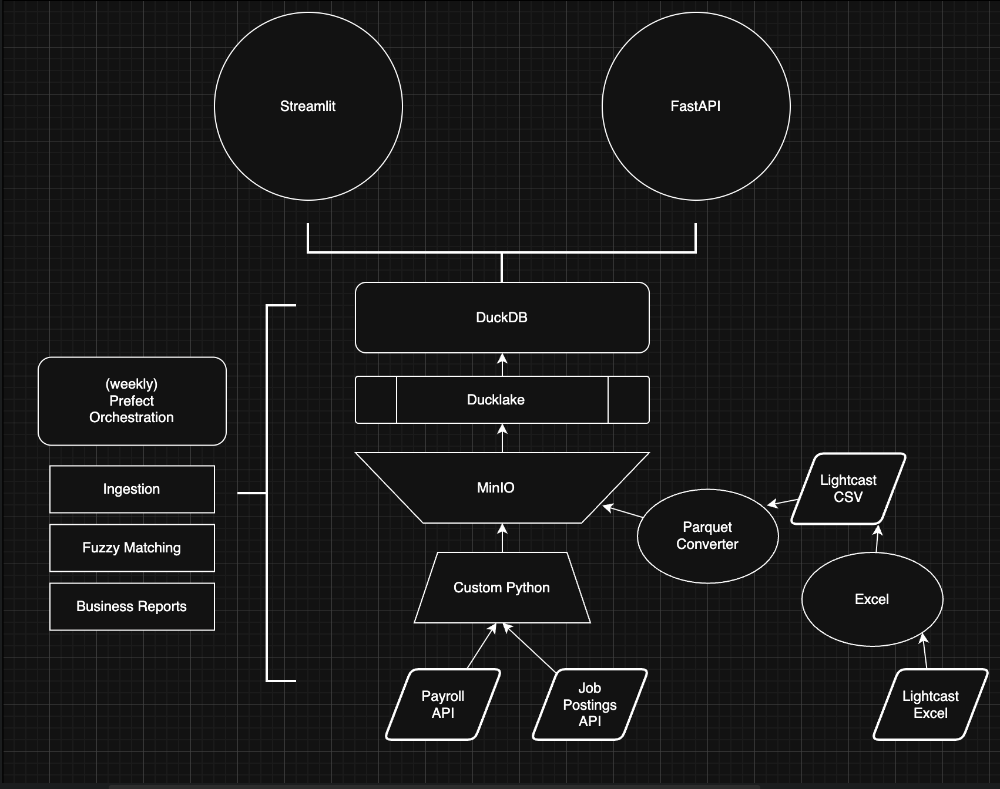

# NYC Government Hiring Audit Data Platform

## Project Overview
This project implements a concise, production-oriented data pipeline to audit NYC government hiring practices. It integrates multiple public and third-party sources (NYC Open Data payroll and job postings, Lighthouse/Lightcast analytics), reconciles job titles with fuzzy string matching, and produces curated audit datasets. Outputs are stored in DuckDB and exposed via an API for analysis — designed to produce actionable insights within a 5-day sprint.

## Deliverables
- Job salary match ratios: fuzzy-matched dataset comparing payroll and job postings
- Job posting duration dataset: fuzzy-matched dataset comparing job posting & salary matches with enriched analytics data

## Learning Objectives
- Design and implement a pragmatic ETL pipeline for multi-source audit data.
- Ingest and enrich data from public APIs and XLSX sources.
- Apply fuzzy string matching to reconcile noisy textual fields (job titles).
- Calculate gold-layer metrics: posting durations and salary match ratios.
- Orchestrate workflows and manage failures with logging and retries.
- Document methodology, findings, and produce consumable outputs (DB + API + dashboard).

## Tech Stack
- Data Exploration: Numbers/Excel | DataGrip
- Languages: Python, SQL
- DB & Catalog: DuckDB, Ducklake
- Object storage: MinIO (S3-compatible)
- Orchestration: Prefect
- Fuzzy matching: rapidfuzz
- API: FastAPI
- Visualization: Streamlit
- Containerization: Docker (for MinIO & Prefect)

## Data Architecture
This project's data architecture was designed to be lightweight, powerful and for the most part free.



### Bronze (raw) layer
- Purpose: raw ingestion 
- Sources: NYC payroll API, NYC job postings API, Lightcast excel tables
- Storage: persisted in DuckDB & minIO

### Gold (cleaned) layer
- Purpose: cleaning, normalization, fuzzy reconciliation, and metric calculation.
- Processes: date filtering, normalization, fuzzy title matching, computation of match ratios, posting durations, and salary metrics.
- Output: curated tables for analysis and downstream consumption.

## Terminal Commands

```bash
# API Development Server
fastapi dev api/main.py
```

```bash
# Streamlit Data Vis
streamlit run streamlit/app.py
```